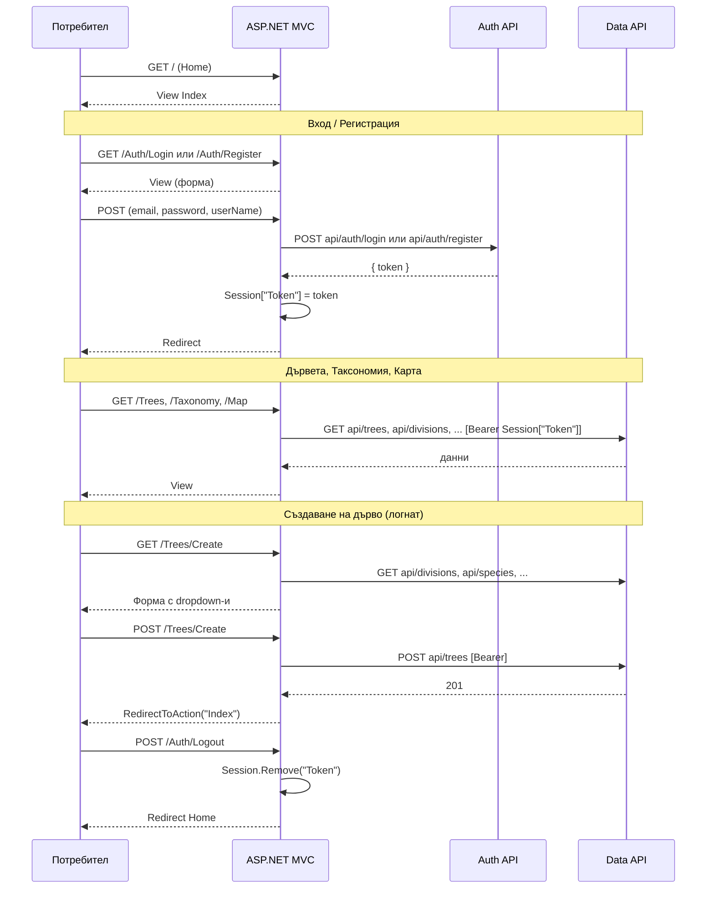

# Sequence диаграма – ASPLeafMapInsightsWebMVC

ASP.NET MVC приложение. Потребителят комуникира само с MVC; MVC извиква Auth API и Data API. JWT се пази в **Session**.

Пълен документ: [../../docs/sequence-diagrams.md](../../docs/sequence-diagrams.md).

