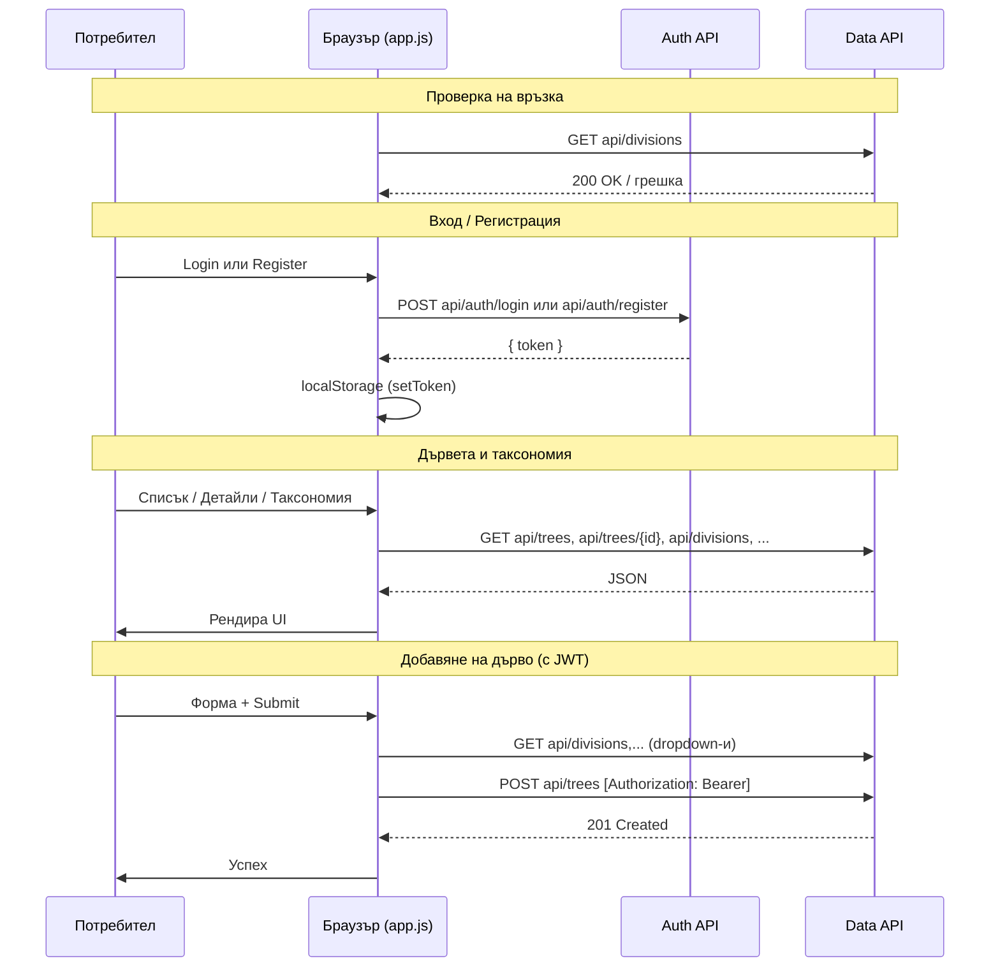

# Sequence диаграма – LeafMapInsightsStaticWeb

Статичен HTML/JS клиент. Браузърът изпраща заявки директно към Auth API и Data API. JWT се пази в `localStorage`.

Пълният документ с всички три приложения: [../docs/sequence-diagrams.md](../docs/sequence-diagrams.md).

