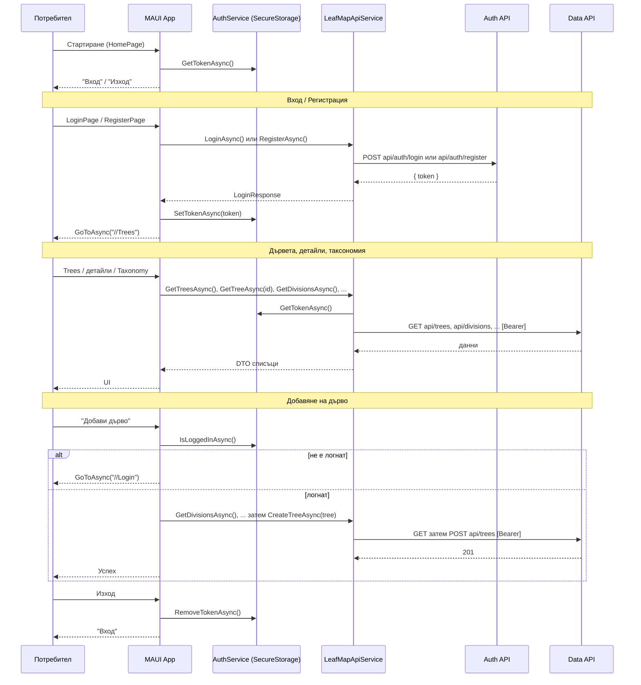

# Sequence диаграма – MAUILeafMapInsights

MAUI приложение. Използва **LeafMapApiService** (HttpClient) и **AuthService** (SecureStorage за JWT). Login/Register → Auth API; останалите заявки → Data API с Bearer.

Пълен документ: [../../docs/sequence-diagrams.md](../../docs/sequence-diagrams.md).

