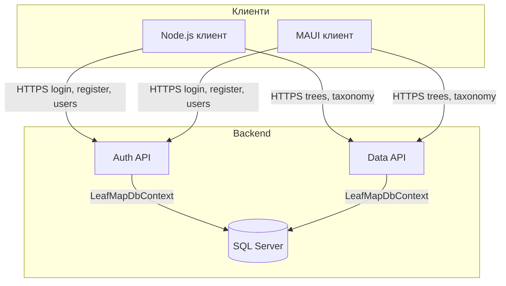
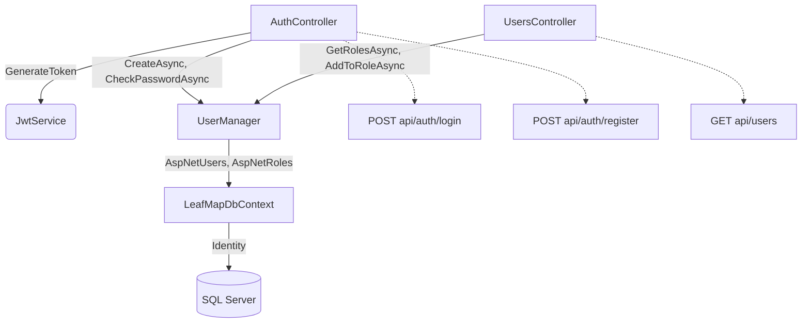
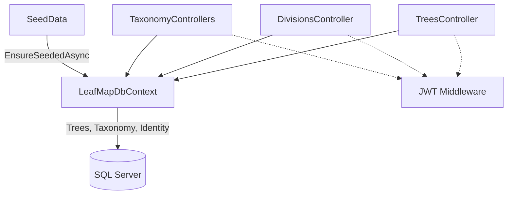
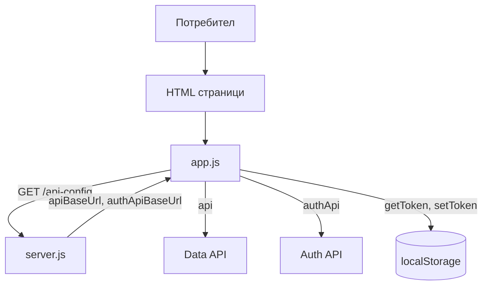
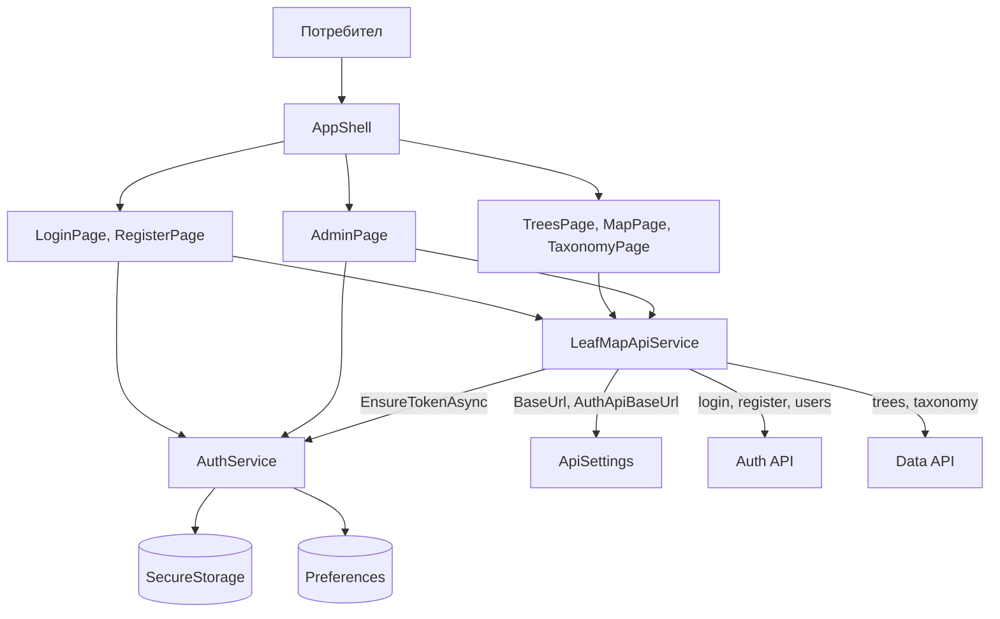
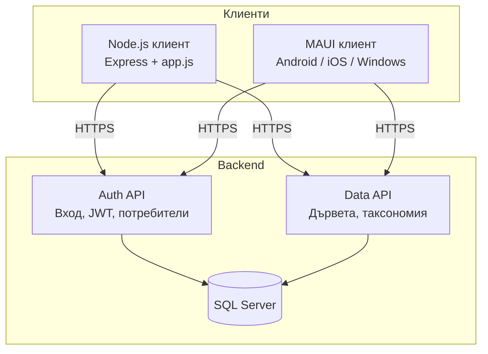
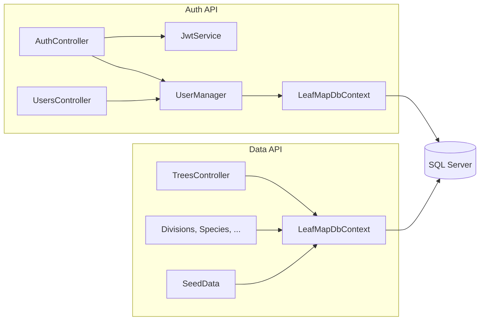

# LeafMap Insights – Компонентни диаграми

Компонентните диаграми показват основните модули на системата и зависимостите между тях. PlantUML източникът е в [component-diagrams.puml](component-diagrams.puml).

---

## 1. Обзор на системата (flowchart TD)

Backend: два API сървъра и една обща база данни. Клиенти: Node.js уеб приложение и MAUI мобилно/десктоп приложение.



---

## 2. Auth API – вътрешни компоненти (flowchart TD)



---

## 3. Data API – вътрешни компоненти (flowchart TD)



---

## 4. Node.js клиент (flowchart TD)



---

## 5. MAUI клиент (flowchart TD)



---

## 6. Обзор на системата (Mermaid subgraph)



---

## 7. Обзор (ASCII)

```
┌─────────────────────────────────────────────────────────────────┐
│                         Backend                                  │
│  ┌──────────────┐    ┌──────────────┐    ┌──────────────────┐   │
│  │  Auth API    │    │  Data API    │    │   SQL Server     │   │
│  │  (JWT, users)│───▶│              │───▶│   (една БД)     │   │
│  └──────┬───────┘    │ trees, tax. │    └──────────────────┘   │
│         │            └──────┬───────┘                            │
│         │                    │                                   │
└─────────┼────────────────────┼───────────────────────────────────┘
          │                    │
          │    HTTPS (JSON)    │
          ▼                    ▼
┌─────────────────────────────────────────────────────────────────┐
│  Node.js клиент (браузър → Auth/Data API)   │  MAUI клиент       │
│  server.js: /api-config, static            │  AuthService,      │
│  app.js: api(), authApi(), localStorage    │  LeafMapApiService │
└─────────────────────────────────────────────────────────────────┘
```

---

## 8. Backend – компоненти и зависимости (Mermaid)



---

## 9. Auth API – вътрешни компоненти (таблица)

| Компонент | Отговорност |
|-----------|-------------|
| **AuthController** | POST api/auth/login, api/auth/register; връща JWT и roles |
| **UsersController** | GET/POST/PUT/DELETE api/users; само за роля Admin |
| **JwtService** | Генерира JWT с claims (userId, email, roles) |
| **UserManager** (Identity) | Създаване на потребители, проверка парола, роли |
| **LeafMapDbContext** | Достъп до AspNetUsers, AspNetRoles (същата БД като Data API) |

Зависимости: AuthController → JwtService, UserManager; UsersController → UserManager; UserManager → LeafMapDbContext → SQL Server.

---

## 10. Data API – вътрешни компоненти (таблица)

| Компонент | Отговорност |
|-----------|-------------|
| **TreesController** | GET/POST/PUT/DELETE api/trees, GET WithinBounds |
| **DivisionsController**, **TaxonomyClassesController**, **GeneraController**, **FamiliesController**, **SpeciesController** | CRUD за референтни таблици |
| **LeafMapDbContext** | Trees, Divisions, Species, Genus, Family, TaxonomyClass + Identity |
| **SeedData** | Първоначално запълване на таксономия |
| **JWT Middleware** | Валидира Bearer токен; [Authorize] на write операции |

Всички контролери използват LeafMapDbContext; един контекст → една БД.

---

## 11. Node.js клиент – компоненти (таблица)

| Компонент | Отговорност |
|-----------|-------------|
| **server.js** | Express; GET /api-config → { apiBaseUrl, authApiBaseUrl }; express.static('public') |
| **app.js** | api() – заявки към Data API; authApi() – заявки към Auth API; getToken/setToken → localStorage; updateAuthUI() |
| **HTML страници** | index.html, login.html, register.html, trees.html, tree.html, taxonomy.html, add-tree.html, admin.html – зареждат app.js |

Заявките от браузъра отиват директно към Auth API и Data API; Node сървърът не прави прокси.

---

## 12. MAUI клиент – компоненти (таблица)

| Компонент | Отговорност |
|-----------|-------------|
| **AuthService** | JWT в SecureStorage; роли в Preferences или от JWT; IsAdminAsync, RemoveTokenAsync |
| **LeafMapApiService** | HttpClient; EnsureTokenAsync; LoginAsync/RegisterAsync → Auth API; GetTreesAsync, CreateTreeAsync, GetDivisionsAsync, GetUsersAsync → Data/Auth API |
| **ApiSettings** | BaseUrl (Data API), AuthApiBaseUrl (Auth API) |
| **Pages** | LoginPage, RegisterPage, HomePage, TreesPage, MapPage, TaxonomyPage, AddTreePage, TreeDetailPage, AdminPage |
| **AppShell** | Навигация, Flyout (Начало, Дървета, Карта, Таксономия, Админ, Вход) |

Зависимости: страниците викат AuthService и LeafMapApiService; LeafMapApiService вика AuthService за токен и ApiSettings за URL.

---

## Как да генерирате изображения от PlantUML

- **VS Code:** разширение "PlantUML"; отворете `component-diagrams.puml` и натиснете Alt+D (или команда Export).
- **Онлайн:** [plantuml.com](https://www.plantuml.com/plantuml/uml/) – копирайте съдържанието на **един** блок от `@startuml` до `@enduml`.
- **CLI:** `java -jar plantuml.jar docs/component-diagrams.puml` – генерира PNG/SVG в същата папка.

В `component-diagrams.puml` има шест диаграми: обзор на системата, Auth API, Data API, Node клиент, MAUI клиент и логическо разположение.

### Ако получите „UnknownDiagramError: No diagram type detected“

Някои прегледащи инструменти (напр. вградени в IDE) поддържат само определени типове диаграми (напр. sequence, use case) и не разпознават компонентните. Можете да:

1. **Използвате само първата диаграма** – копирайте само първия блок `@startuml Component_System_Overview` … `@enduml` от `component-diagrams.puml` и го поставете в [plantuml.com](https://www.plantuml.com/plantuml/uml/).
2. **Отворите алтернативния файл** – [component-system-overview.puml](component-system-overview.puml) съдържа същия обзор като **class diagram** (класове и пакети), което повечето рендерери разпознават.
3. **Актуализирате PlantUML** – с по-нова версия (1.2022+) типът на компонентните диаграми се разпознава по-надеждно.
