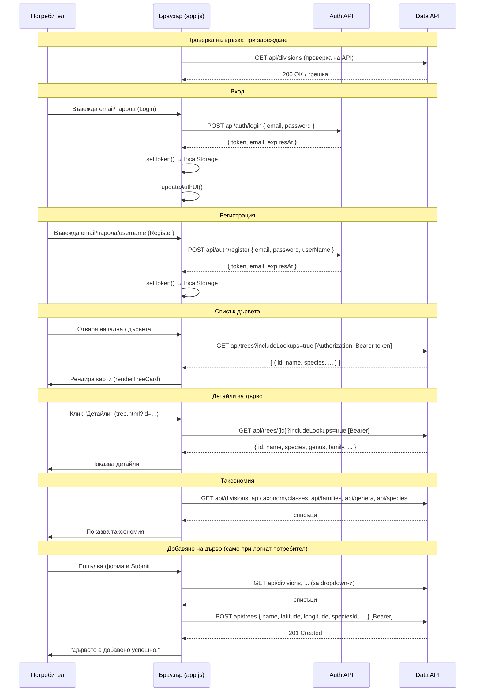
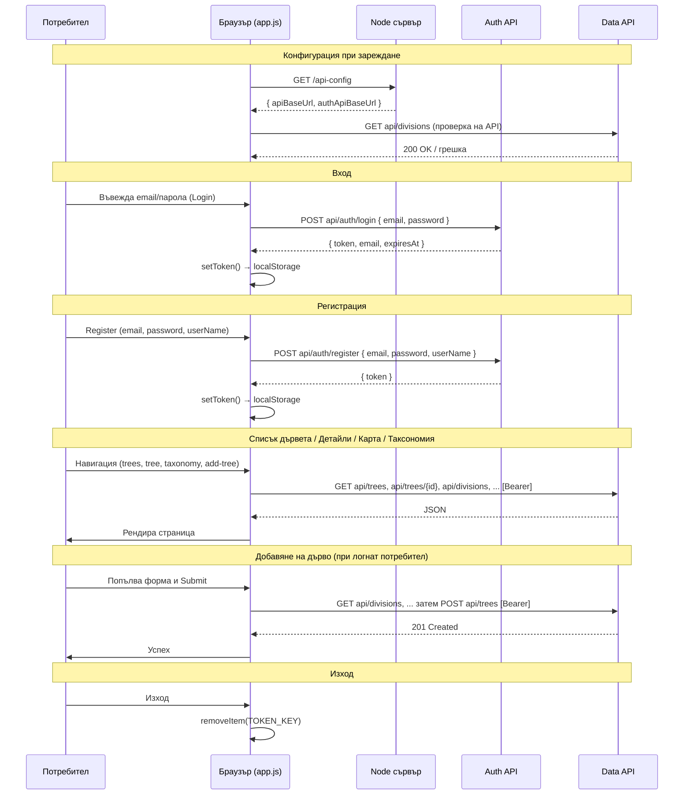
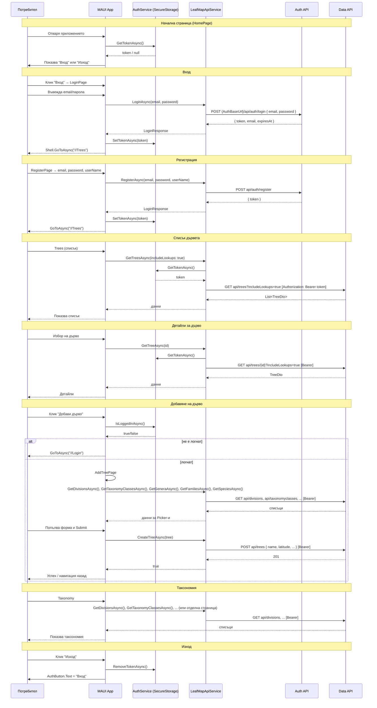

# Sequence диаграми – LeafMap Insights

Този документ съдържа sequence диаграми за трите клиентски приложения, които комуникират с **LeafMap Insights Auth API** и **LeafMap Insights Data API**. За обзор **през коя апликация какво можем да правим** вижте [use-case-diagram.md](use-case-diagram.md).

**PlantUML версия:** Всички диаграми са налични и като PlantUML в [sequence-diagrams.puml](sequence-diagrams.puml) (Node.js, Auth API, Data API, MAUI + обзор).

---

## 1. LeafMapInsightsStaticWeb (статичен HTML/JS клиент)

Браузърът зарежда статични страници; JavaScript изпраща заявки директно към Auth API и Data API. JWT се пази в `localStorage`.

---

## 2. LeafMapInsightsNodeClient (Node.js уеб сайт)

Уеб сайтът е **Node.js** приложение (Express). Сървърът обслужва статични страници от `public/` и подава API адресите чрез `GET /api-config`. Браузърът след това изпраща заявки **директно** към Auth API и Data API; JWT се пази в `localStorage` (също като Static Web).

---

## 3. MAUILeafMapInsights (MAUI мобилно/десктоп приложение)

Приложението използва **LeafMapApiService** (HttpClient) и **AuthService** (SecureStorage за JWT). Login/Register отиват към Auth API; всички останали заявки към Data API с Bearer токен.

---

## Обобщение на компонентите

| Проект | Клиент | Съхранение на JWT | Auth извиквания | Data API извиквания |
|--------|--------|-------------------|------------------|---------------------|
| **LeafMapInsightsStaticWeb** | Браузър (HTML/JS) | localStorage | директно към Auth API | директно с Bearer |
| **LeafMapInsightsNodeClient** (Node.js сайт) | Браузър → Node за /api-config, после директно | localStorage | директно към Auth API | директно с Bearer |
| **MAUILeafMapInsights** | MAUI приложение | SecureStorage | LeafMapApiService → Auth API | LeafMapApiService → Data API с Bearer от AuthService |

Всички три приложения използват един и същ **Auth API** (`api/auth/login`, `api/auth/register`) и един и същ **Data API** (trees, divisions, taxonomyclasses, families, genera, species). Уеб сайтът е **Node.js** (LeafMapInsightsNodeClient); ASP.NET MVC е премахнат.
