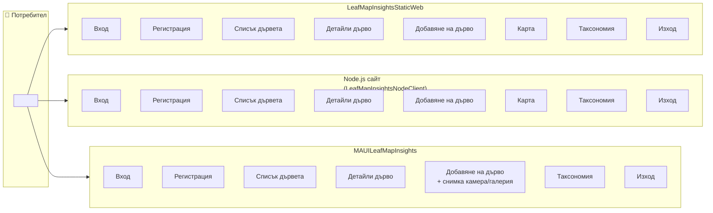

# Use Case – през коя апликация какво можем да правим

Този документ описва **кои възможности** са налични във **всяка от трите клиентски апликации** на LeafMap Insights (Auth API + Data API).

---

## Обяснение

| Апликация | Описание | Порт / как се пуска |
|-----------|----------|----------------------|
| **LeafMapInsightsStaticWeb** | Статичен уеб сайт (само HTML/JS/CSS). Отваря се директно от файловата система или през HTTP сървър. API адресите се задават в браузъра (localStorage). | Статични файлове, напр. от `LeafMapInsightsStaticWeb/` |
| **LeafMapInsightsNodeClient** | **Node.js уеб сайт** (апликация за сайт). Express сървър обслужва страниците и подава API адресите чрез `/api-config`. JWT в `localStorage`. | `npm start` → http://localhost:3000 |
| **MAUILeafMapInsights** | Мобилно/десктоп приложение (MAUI). Вход, списък дървета, добавяне на дърво (вкл. снимка от камера/галерия), таксономия. JWT в SecureStorage. | Visual Studio / `dotnet run` |

---

## Use Case диаграма (Mermaid)

Потребителят може да изпълнява следните use case-ове; таблицата и схемата показват **през коя апликация** е възможно.

---

## Таблица: какво можем да правим през всяка апликация

| Use case | Static Web | Node.js сайт | MAUI |
|----------|:----------:|:------------:|:----:|
| **Вход** | ✅ | ✅ | ✅ |
| **Регистрация** | ✅ | ✅ | ✅ |
| **Преглед списък дървета** | ✅ | ✅ | ✅ |
| **Детайли за дърво** | ✅ | ✅ | ✅ |
| **Добавяне на дърво** | ✅ (форма) | ✅ (форма) | ✅ (форма + **снимка**) |
| **Преглед карта** | ✅ | ✅ | ✅ |
| **Таксономия** | ✅ | ✅ | ✅ |
| **Изход** | ✅ | ✅ | ✅ |

- **Node.js сайт** е апликацията за уеб сайт (замества предишния ASP.NET MVC). Има същите възможности като Static Web, но конфигурацията на API идва от сървъра (`/api-config`).
- **MAUI** позволява **добавяне на дърво със снимка** (камера или галерия); уеб версиите добавят дърво само чрез форма с координати и вид.

---

## Draw.io

Use case диаграмата в стил UML (актьор, системи, елипси за use case) е в:

- **`docs/drawio/LeafMapInsights-use-case.drawio`**

Отворете я в [diagrams.net](https://app.diagrams.net/) (draw.io).
